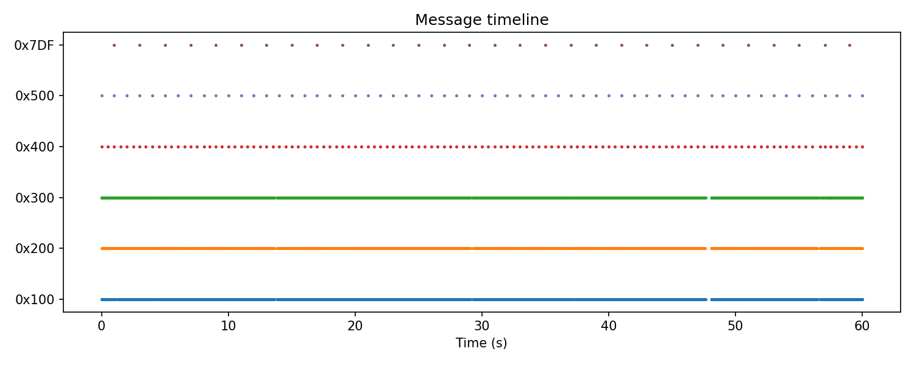
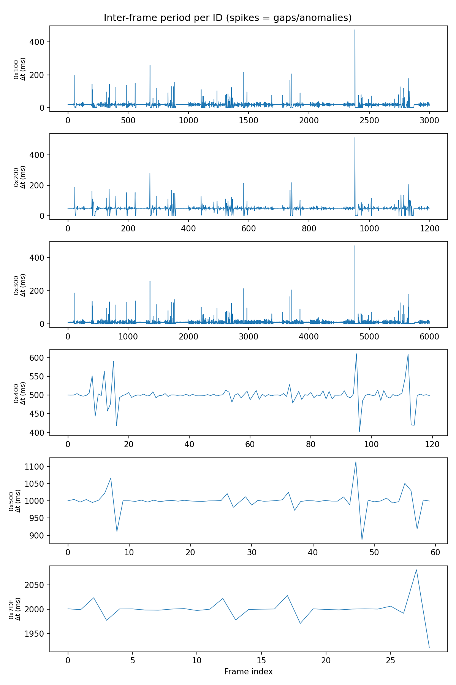

# CAN Traffic Sniffer & Analyzer

A toolkit for generating, capturing, and analyzing CAN bus traffic using a
virtual CAN interface (`vcan0`) on Linux. Simulates multiple ECUs, captures
their traffic, and produces statistics and visualizations of message
patterns — a sandbox for practicing CAN bus analysis without real hardware.

## Why

Real vehicle CAN buses are hard to safely experiment on. This project
builds a realistic-enough simulated bus (multiple IDs, different send
rates, changing vs. static payload bytes, a rolling counter, a diagnostic
request ID) so the analysis tooling can be developed and tested end to end.

## Components

| Script                     | Purpose                                              |
|-----------------------------|-------------------------------------------------------|
| `scripts/generate_traffic.py` | Simulates 6 ECUs sending periodic CAN frames on `vcan0` |
| `scripts/analyze_can.py`      | Parses a `candump -L` log into per-ID statistics       |
| `scripts/visualize_can.py`    | Generates frequency, timeline, jitter, and payload plots |

## Setup

```bash
sudo apt install -y can-utils python3-venv
sudo modprobe vcan
sudo ip link add dev vcan0 type vcan
sudo ip link set up vcan0

python3 -m venv venv
source venv/bin/activate
pip install -r requirements.txt
```

## Usage

**1. Generate traffic** (in one terminal):
```bash
python3 scripts/generate_traffic.py
```

**2. Capture it** (in another terminal):
```bash
candump -L vcan0 > logs/capture1.log
```

**3. Analyze:**
```bash
python3 scripts/analyze_can.py logs/capture1.log --csv docs/stats.csv
```

**4. Visualize:**
```bash
cd scripts
python3 visualize_can.py ../logs/capture1.log --outdir ../docs/plots
```

## Simulated bus layout

| ID    | Period | Payload behavior                          |
|-------|--------|--------------------------------------------|
| 0x100 | 20 ms  | Simulated engine RPM (16-bit, sine wave)   |
| 0x200 | 50 ms  | Simulated vehicle speed (8-bit, sine wave) |
| 0x300 | 10 ms  | Simulated steering angle (signed 16-bit)   |
| 0x400 | 500 ms | Door status (mostly static, occasional change) |
| 0x500 | 1 s    | Heartbeat / rolling counter                |
| 0x7DF | 2 s    | Diagnostic-style request                   |

## Sample output

**Per-ID statistics** (from `analyze_can.py`):

| id    | frames | rate_hz | period_mean_ms | period_std_ms | varying_bytes |
|-------|--------|---------|-----------------|-----------------|----------------|
| 0x100 | 3001   | 50.01   | 20.00           | 17.33           | 0,1            |
| 0x300 | 6001   | 100.01  | 10.00           | 12.83           | 0,1            |
| ...   |        |         |                 |                 |                |

**Message timeline:**


**Per-ID period jitter (spikes indicate gaps/anomalies):**


## Notes

- `period_std_ms` in the simulated data reflects Python scheduling jitter,
  not real bus timing. On a real CAN bus, tight periodic IDs (e.g. wheel
  speed sensors) show far less jitter than this.
- Large jumps in `period_max_ms` typically indicate a dropped/delayed
  frame, a stalled sender, or (on a real bus) something worth
  investigating — a jammed bus, an ECU going offline, or replay/injection
  activity.

## License

MIT
